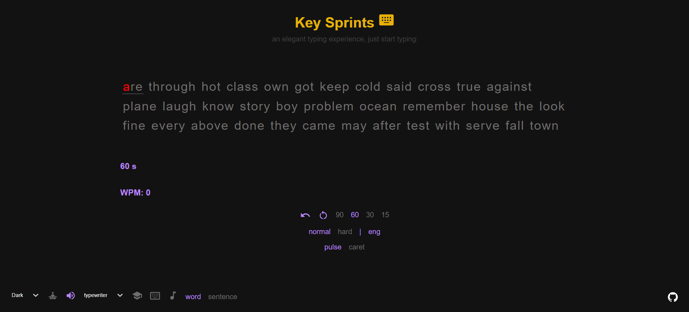
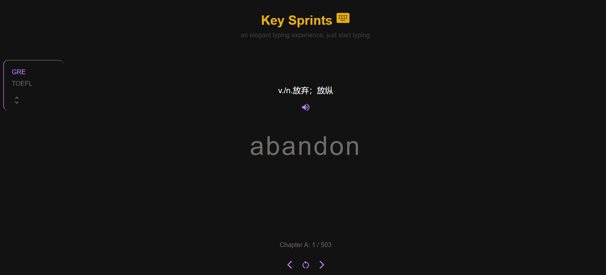
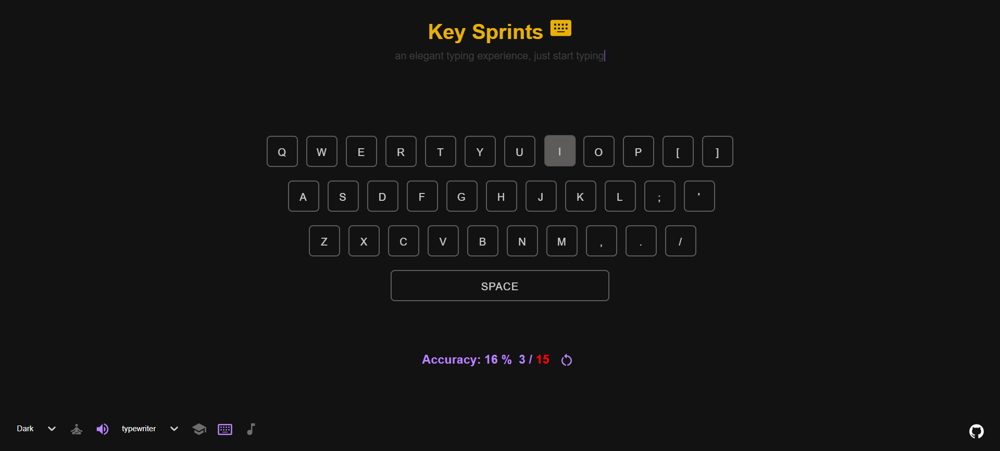
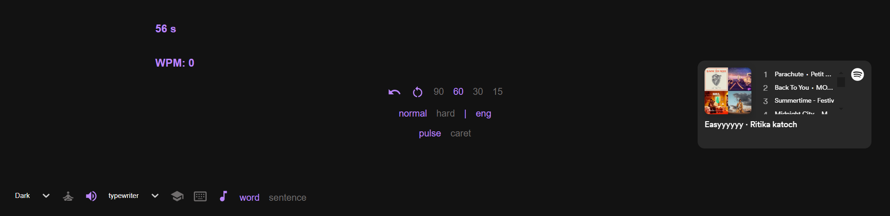
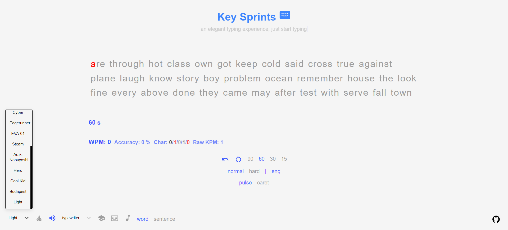
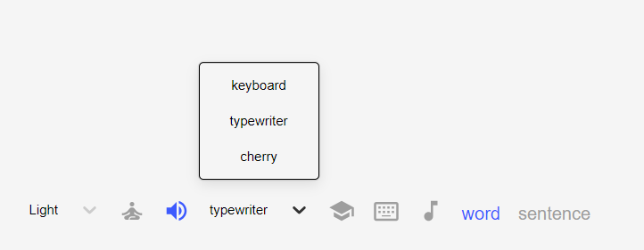

# Key Sprints

# Typing Master - English Edition

Welcome to Typing Master - English Edition! This versatile typing tool offers a range of features to enhance your typing skills and make practice enjoyable.

## Features:

### 1. Typing Test
- **Words Mode**: Practice typing English words or sentences.
  - Eng Hard: Random blogs words data source.
  - Eng Normal: Top 1000 most frequently used English words.
  - Numbers and Symbols: Add random numbers (0-99) or symbols to words.
  - Duration: Choose from 15s, 30s, 60s, or 90s tests.
- **Sentence Mode**: Practice typing English sentences.
  - ENG: Random English short sentences.
  - Sentence Count: Choose from 5, 10, or 15 sentences.

### 2. Words Card (for English Learners)
- Study English vocabulary from various sources like GRE, TOEFL.
- Navigate through multi-chapter selections.
- Recite Mode: Test your memory by hiding word visibility while showing phrases.

### 3. Coffee Mode
- Free typing mode for practicing anything.

### 4. QWERTY Keyboard Touch-Typing Trainer
- Train on a QWERTY keyboard layout with random keys for touch typing. Track your progress with stats.

### 5. Spotify Player
- Access the Spotify player for listening to your favorite tunes while typing.

### 6. Themes Collection
- Choose from a variety of static and dynamic themes to customize your typing environment.

### 7. LocalStorage Persistence
- Essential settings are stored in LocalStorage, ensuring your preferences are retained even after browser refresh.

### 8. Focus Mode
- Optimize your typing practice by moving the header to the footer and hiding the settings menu.

### 9. Typing Sound Effect
- Enjoy typing with different sound effects, including cherry blue switch, keyboard, or typewriter.

### 10. Fast Redo/Reset with [Tab] Key
- Use [Tab] key shortcuts for quick redo/reset actions.

### Caps Lock Detection
- Caps Lock detection feature to help improve typing accuracy.

### Simplified Typing Stats
- View simplified typing statistics to track your progress effortlessly.

Explore KeySprints - English Edition and take your typing skills to the next level!